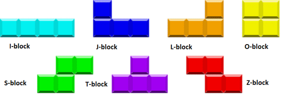

# Tetris comptetitive edition
Tetris game with competetive gamemode!

## Tetrominos

## Blocks rotation

## Conventions
### Commits
* https://www.conventionalcommits.org/en/v1.0.0/
### File management
* https://learn.microsoft.com/en-us/cpp/cpp/header-files-cpp?view=msvc-170
* https://www.geeksforgeeks.org/header-files-in-c-cpp-and-its-uses/
